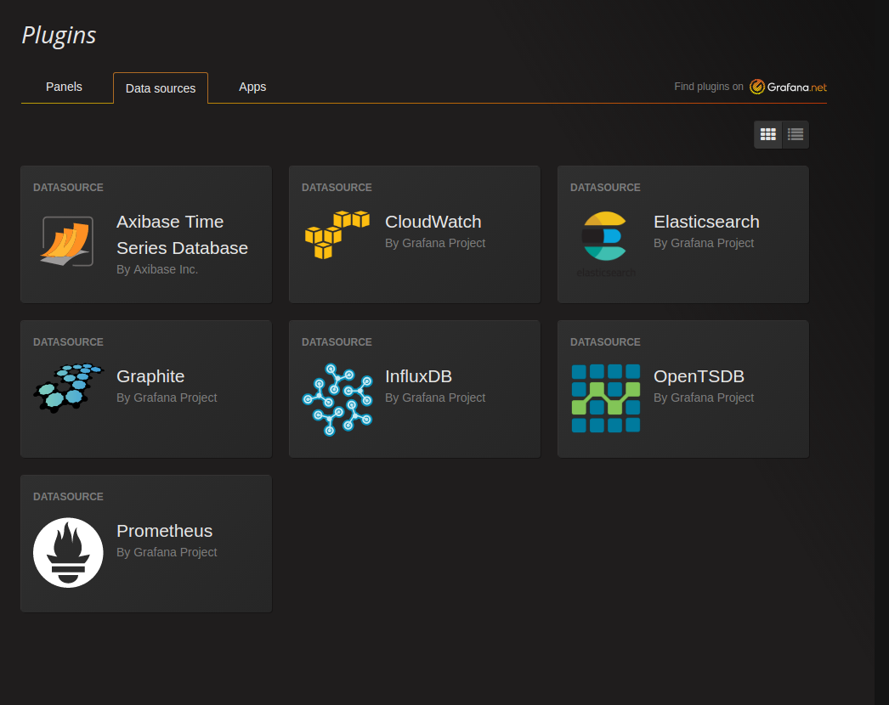

# Grafana Datasource plugin for Axibase Time Series Database

Axibase Time Series Database was designed from the ground-up to store and analyze time-series data at scale. Unlike traditional databases it comes with Rule Engine, Data Versioning, SQL Query Language, Data Forecasting and more. [Learn more about ATSD on axibase.com](http://axibase.com/products/axibase-time-series-database/) 

### Requirements

* Instance of ATSD
* Grafana > 3.x.x

### Installation

*  Clone this repository into Grafana plugin folder (`default`: `/var/lib/grafana/plugins`)

```sh
sudo git clone https://github.com/axibase/grafana.git /var/lib/grafana/plugins/atsd
```

* Restart your Grafana server

```sh
sudo service grafana-server restart
```

### Verify plugin installation
 
 * Go to Grafana UI.
 * Open Menu -> Plugins.
 * Select datasource type
 * Axibase Time Series Database should appear on this page.
 
 