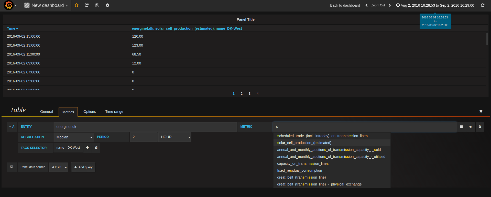

# Grafana Datasource plugin for Axibase Time Series Database

[Axibase Time Series Database](http://axibase.com/products/axibase-time-series-database/) makes it easy and convenient to store time series data at scale. It provides Network API, REST API, SQL query and other capabilities to analyze and visualize raw numeric observations both via a built-in visualization library as well as via widely-used external dashboarding tools such as [Grafana](http://grafana.org/).

### Requirements

* ATSD 14000+
* Grafana 3+

### Installation

*  Clone this repository into Grafana plugin folder (`default`: `/var/lib/grafana/plugins`)

```bash
sudo git clone https://github.com/axibase/grafana.git /var/lib/grafana/plugins/atsd
```

* Restart Grafana

```bash
sudo service grafana-server restart
```

### Verify Installation
 
 * Go to Grafana UI.
 * Open Menu -> Plugins.
 * Select datasource type
 * Select Axibase Time Series Database datasource
 


### Examples

| [#1](img/examples/example4.png?raw=true) | [#2](img/examples/example2.png?raw=true) | [#3](img/examples/example3.png?raw=true) |
| ------ | ------ | ----- |
|  |  |  |
