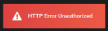

# ATSD Grafana Plugin


## Table of Contents

* [Overview](#overview)
* [Requirements](#requirements)
* [Installation](#installation)
* [Examples](#examples)

## Overview

[Axibase Time Series Database](https://axibase.com/docs/atsd/) is a non-relational database optimized for collecting, storing, and analyzing temporal data from IT infrastructure, industrial equipment, smart meters, and IoT devices. ATSD features [Network API](https://axibase.com/docs/atsd/api/network/), [REST API](https://axibase.com/docs/atsd/api/data/), [SQL](https://axibase.com/docs/atsd/sql/sql-console.html), and other capabilities to analyze numeric observations and the built-in visualization library [Charts](https://github.com/axibase/charts/blob/master/README.md) to display them. Additionally, use the third-party dashboarding tool [Grafana](http://grafana.org/) with data stored in ATSD.

### Requirements

* [ATSD `14000+`](https://axibase.com/docs/atsd/installation/)
* [Grafana `3+`](https://grafana.com/get)

## Installation

Clone the **ATSD Grafana Plugin** repository to the Grafana `plugins` directory. By default, this directory is `/var/lib/grafana/plugins`.

```bash
sudo git clone https://github.com/axibase/grafana-data-source.git /var/lib/grafana/plugins/atsd
```

Restart Grafana.

```bash
sudo service grafana-server restart
```

After restarting Grafana, access the user interface at `http://localhost:3000/`. From the left menu, select **Configuration > Plugins**.


Axibase Time Series Database is visible in the plugin library.


From the **Data Sources** tab, click **Add data source**


Select **Axibase Time Series Database** from the **Type** drop-down list, and enter your ATSD instance hostname.


Select **Basic Auth** under the **Auth** header and enter valid login credentials to your ATSD instance.


Click **Save & Test**. Grafana notifies that the connection succeeded.


In the event of server connection error, Grafana shows an alert. Confirm login credentials and configuration. Refer to [Grafana Troubleshooting](http://docs.grafana.org/installation/troubleshooting/) documentation for more information.



On the **Home Dashboard** page, ATSD is visible under the **Installed Datasources** header.


## Examples

To create dashboards, complete datasource [installation and configuration](#installation).

> If you are unfamiliar with Grafana, refer to [Getting Started](http://docs.grafana.org/guides/getting_started/) documentation.

From the **Home Dashboard**, click **New Dashboard**.


Select a dashboard component (these examples use the **Graph** option). Expand the **Panel Title** drop-down list and click **Edit**.


Set **Data Source** to ATSD if you have used a different database as the default location.


The following configurations demonstrate example Grafana visualization:

### Example 1

* Tabular view
* Tag Selection
* Aggregation


### Example Two

* Entity [wildcard](https://axibase.com/docs/atsd/search/entity-search.html#wildcards) (`*`)
* Include all tags


### Example Three

* Multiple tags
* Tag auto-complete feature


